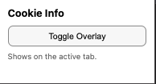
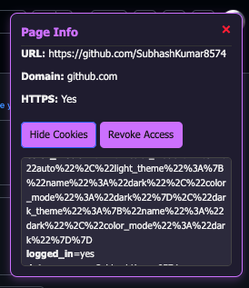

# 🍪 Cookie Info Overlay Extension


## 📌 Overview
This Chrome Extension injects an overlay into every webpage to manage and display cookie information.  

**Features include:**
- 🌐 Shows current page URL and domain  
- 🔒 Displays HTTPS status  
- 🍪 Button to request cookie access at runtime  
- ✅ Once permission is granted:  
  - Displays cookies for the current domain  
  - Updates cookie list in real-time when cookies change  
  - Options to **revoke cookie access** or **clear cookies**

---

## 🛡️ Permissions
- `"activeTab"` → Interact with the current tab  
- `"scripting"` → Inject content scripts  
- `"storage"` → Store UI state  
- `"cookies"` → Requested at runtime **only**, not in the manifest  

---

## 🔄 Communication
- **Content script** → creates overlay, sends requests  
- **Background script** → handles cookies, permissions, and events  
- **Messaging** → `chrome.runtime.sendMessage` & `chrome.runtime.onMessage`

---

## 🔐 Security
- Cookie data **never exposed to webpage JS**  
- Handled entirely inside the extension context  
- Runtime permissions ensure a **least-privilege model**

---

## 🎁 Bonus Features
- 🚫 Revoke cookie access for the current domain  
- 🧹 Clear all cookies for the current domain  

---

## 🖼️ Screenshot
  
 

---

## 📂 Folder Structure

| Folder / File   | Description                    |
| --------------- | ------------------------------ |
| `background/`   | Background scripts             |
| `content/`      | Content scripts                |
| `icons/`        | Extension icons                |
| `popup/`        | Popup HTML, CSS, and JS files  |
| `ui/`           | Additional UI components       |
| `manifest.json` | Chrome extension manifest file |


---

## 🚀 Installation
1. Clone this repository:
   ```bash
   git clone https://github.com/SubhashKumar8574/CookieAccessManager_Extension.git


